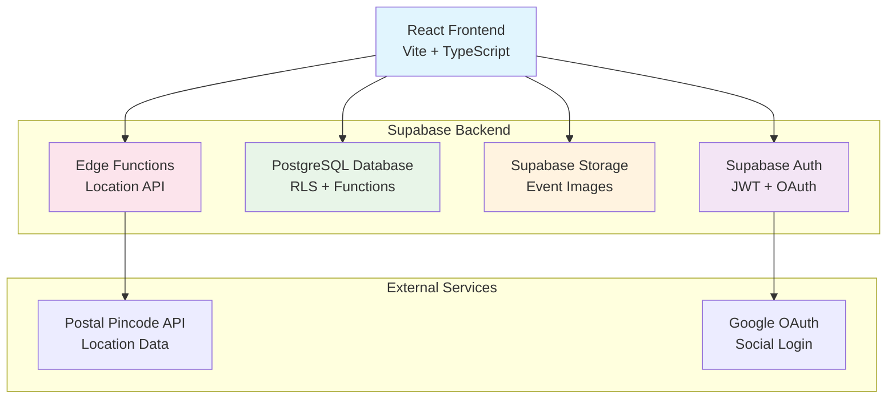
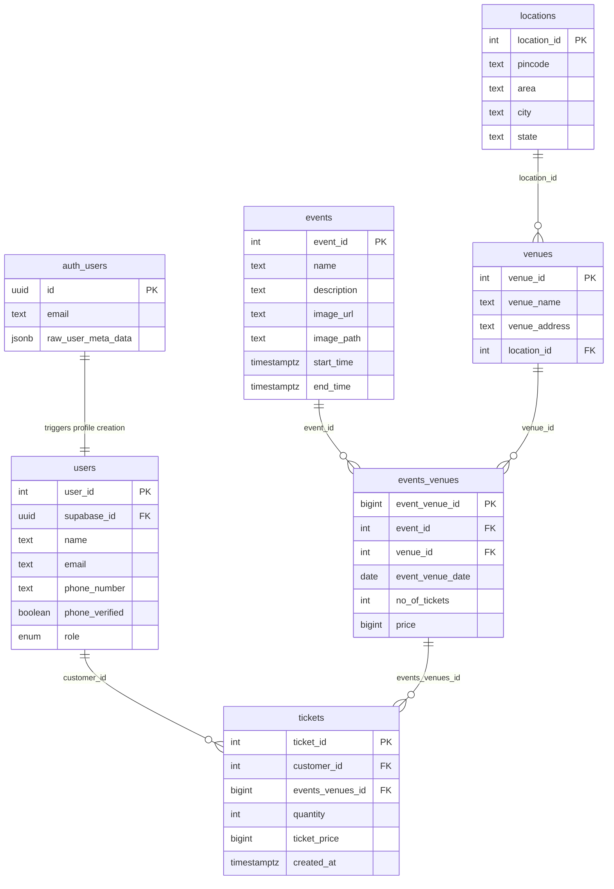
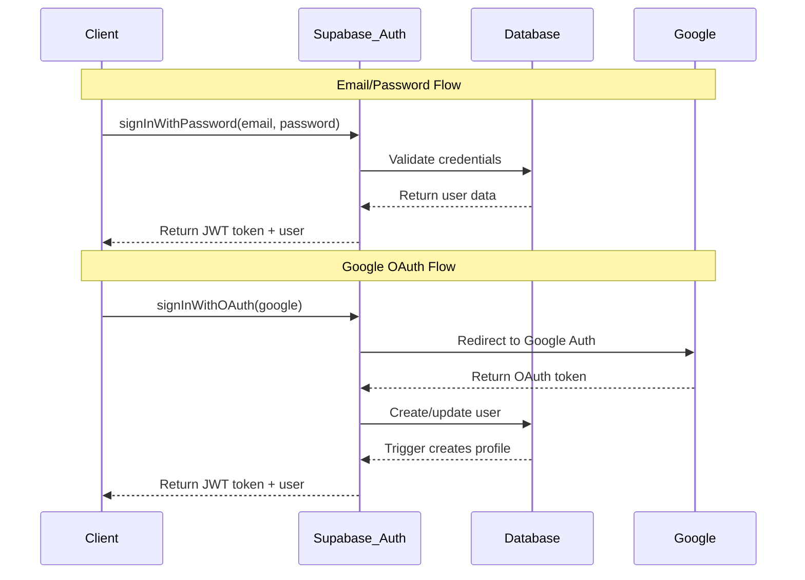
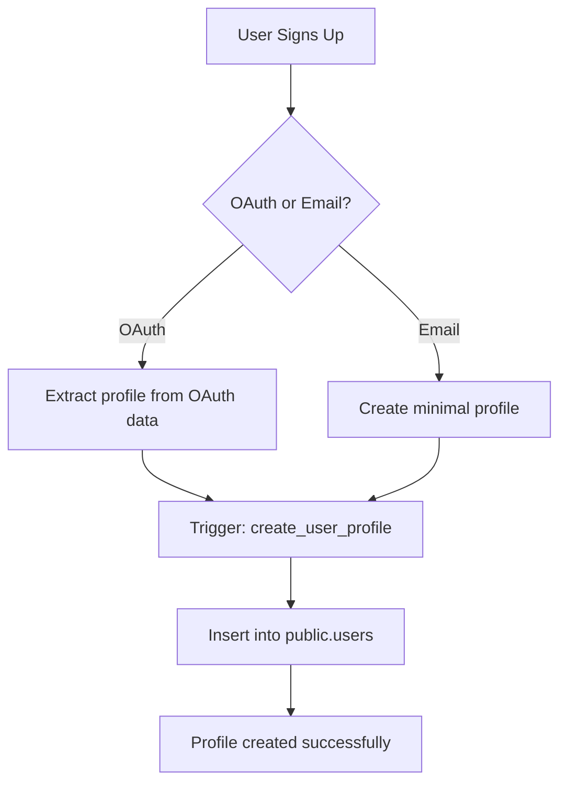
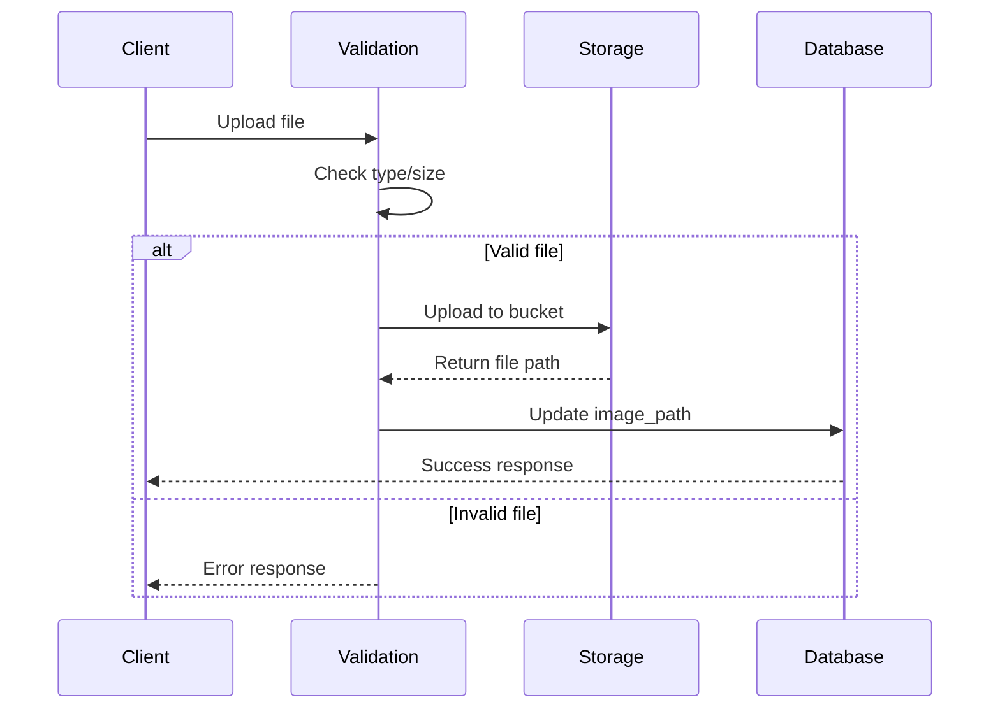
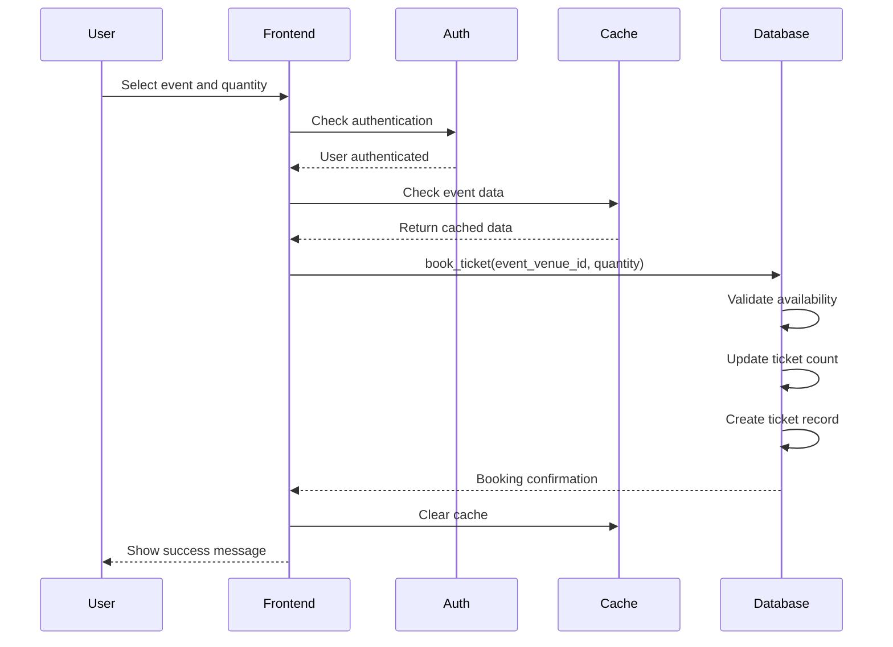
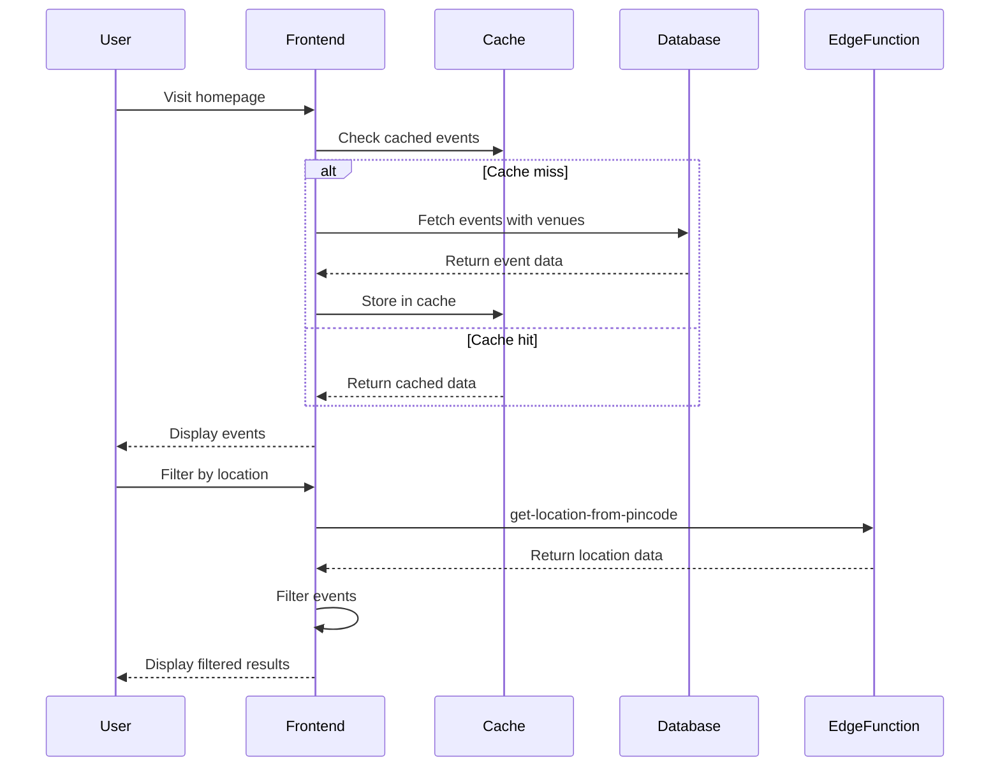
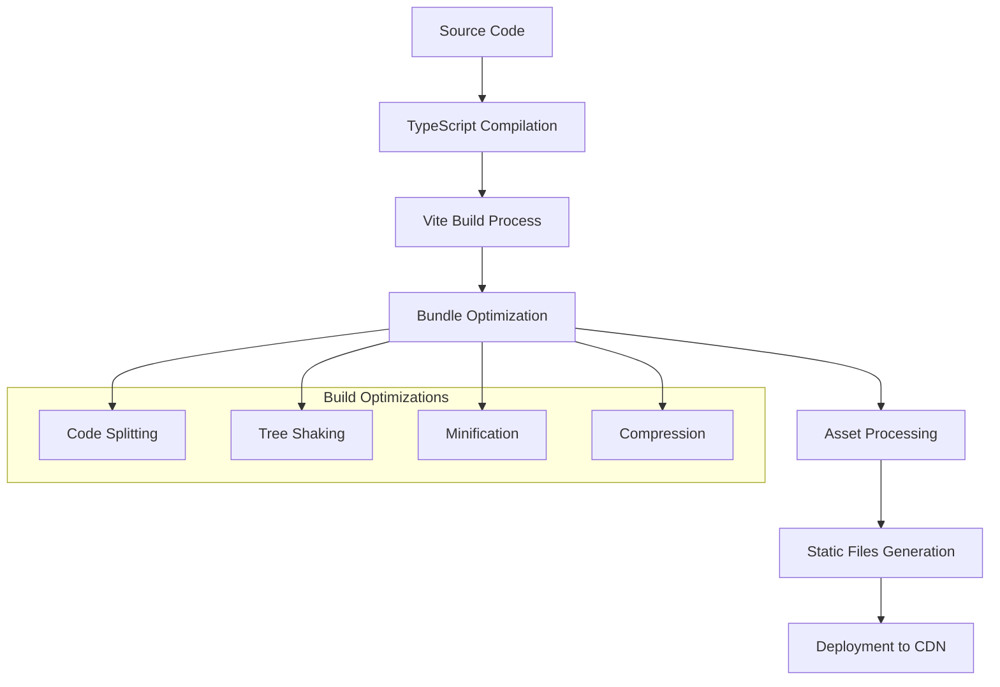

# Architecture Overview

This document provides a comprehensive overview of the Event Booking Platform's architecture, design decisions, and system components.

## 🏗️ System Architecture

### High-Level Architecture



## 🎯 Design Principles

### 1. Security First

- **Row Level Security (RLS)**: All database operations are secured at the database level
- **JWT Authentication**: Stateless authentication with automatic token management
- **Input Validation**: Client and server-side validation using Zod schemas
- **File Upload Security**: Type and size validation for all uploads

### 2. Performance Optimization

- **Caching Strategy**: 5-minute TTL cache for frequently accessed data
- **Lazy Loading**: Images and components loaded on demand
- **Database Optimization**: Efficient queries with proper indexing
- **Bundle Splitting**: Optimized JavaScript bundles for faster loading

### 3. Maintainability

- **TypeScript**: Full type safety throughout the application
- **Component Architecture**: Reusable UI components with shadcn/ui
- **Clear Separation**: Business logic separated from presentation
- **Comprehensive Testing**: Unit and integration tests for all components

### 4. Scalability

- **Stateless Design**: No server-side session storage
- **Database Functions**: Complex business logic handled in the database
- **Edge Functions**: External API calls handled at the edge
- **Horizontal Scaling**: Architecture supports horizontal scaling

## 🔧 Frontend Architecture

### Component Hierarchy

```
src/
├── main.tsx                 # Application entry point
├── App.tsx                  # Root component with routing
├── components/
│   ├── ui/                  # shadcn/ui components
│   │   ├── button.tsx
│   │   ├── dialog.tsx
│   │   ├── input.tsx
│   │   └── ...
│   ├── auth/                # Authentication components
│   │   ├── LoginForm.tsx
│   │   ├── SignupForm.tsx
│   │   └── GoogleOAuthButton.tsx
│   └── layout/              # Layout components
│       ├── Header.tsx
│       ├── Footer.tsx
│       └── Navigation.tsx
├── pages/                   # Route components
│   ├── HomePage.tsx
│   ├── EventDetailPage.tsx
│   ├── BookingConfirmationPage.tsx
│   └── ...
├── contexts/                # React contexts
│   ├── AuthContext.tsx      # Authentication state
│   └── AppStateContext.tsx  # Application state + caching
├── hooks/                   # Custom React hooks
├── lib/                     # Utility functions
│   ├── utils.ts            # General utilities
│   └── storage.ts          # Storage operations
└── types/                   # TypeScript type definitions
```

### State Management

#### Authentication Context

```typescript
interface AuthContextType {
  user: User | null;
  userProfile: DatabaseUser | null;
  loading: boolean;
  signIn: (email: string, password: string) => Promise<void>;
  signUp: (email: string, password: string) => Promise<void>;
  signOut: () => Promise<void>;
  updateProfile: (updates: Partial<DatabaseUser>) => Promise<void>;
}
```

#### App State Context with Caching

```typescript
interface AppStateContextType {
  // Cached data with TTL
  events: Event[] | null;
  venues: Venue[] | null;
  eventVenue: EventVenue | null;

  // Loading states
  eventsLoading: boolean;
  venuesLoading: boolean;
  eventVenueLoading: boolean;

  // Cache management
  clearCache: () => void;

  // Data fetching functions
  fetchEvents: () => Promise<Event[]>;
  fetchVenues: () => Promise<Venue[]>;
  fetchEventVenue: (id: string) => Promise<EventVenue>;
}
```

### Routing Architecture

```typescript
// Protected routes wrapper
<ProtectedRoute>
  <Route path="/my-bookings" element={<MyBookingsPage />} />
  <Route path="/account" element={<AccountPage />} />
  <Route path="/admin/events" element={<AdminEventPage />} />
  <Route
    path="/book/confirm/:eventVenueId"
    element={<BookingConfirmationPage />}
  />
</ProtectedRoute>
```

## 💾 Database Architecture

### Entity Relationship Design

The database follows a normalized relational design with proper foreign key constraints:



### Key Design Decisions

#### 1. Many-to-Many Events-Venues Relationship

**Decision**: Use junction table `events_venues` instead of direct foreign key
**Rationale**:

- Supports events at multiple venues (like concert tours)
- Allows different pricing per venue
- Enables different dates per venue
- Provides flexibility for future expansion

#### 2. Separate User Tables

**Decision**: Maintain separate `auth.users` and `public.users` tables
**Rationale**:

- `auth.users`: Managed by Supabase Auth, contains authentication data
- `public.users`: Application-specific profile data with business logic
- Trigger automatically creates profile when auth user is created

#### 3. Quantity in Tickets Table

**Decision**: Store quantity directly in tickets table instead of separate rows
**Rationale**:

- Simpler data model
- Easier to query and aggregate
- Better performance for reporting
- Maintains transaction atomicity

### Database Functions

#### `book_ticket(p_event_venue_id, p_quantity)`

```sql
-- Business logic for ticket booking
-- 1. Validates user authentication
-- 2. Checks ticket availability
-- 3. Updates available ticket count
-- 4. Creates ticket record
-- All operations in a single transaction
```

#### `get_my_bookings()`

```sql
-- Secure retrieval of user's bookings
-- Uses SECURITY DEFINER to bypass RLS
-- Returns only tickets for authenticated user
-- Joins with event and venue data
```

#### `create_user_profile()`

```sql
-- Trigger function for automatic profile creation
-- Fires after INSERT on auth.users
-- Extracts name from OAuth metadata
-- Creates corresponding public.users record
```

### Row Level Security (RLS) Policies

#### Users Table

```sql
-- Read own profile
CREATE POLICY "read_own_profile" ON users
  FOR SELECT USING (supabase_id = auth.uid());

-- Update own profile
CREATE POLICY "update_own_profile" ON users
  FOR UPDATE USING (supabase_id = auth.uid());
```

#### Tickets Table

```sql
-- View own tickets only
CREATE POLICY "view_own_tickets" ON tickets
  FOR SELECT USING (customer_id IN (
    SELECT user_id FROM users WHERE supabase_id = auth.uid()
  ));
```

#### Events Table

```sql
-- Public read access for all events
CREATE POLICY "public_read_events" ON events
  FOR SELECT TO anon, authenticated USING (true);
```

## 🔐 Authentication Flow

### Authentication Architecture



### Session Management

1. **JWT Tokens**: Automatically managed by Supabase client
2. **Refresh Tokens**: Automatic refresh before expiration
3. **Persistent Sessions**: Sessions persist across browser restarts
4. **Logout Cleanup**: Complete session cleanup on logout

### Profile Creation Flow



## 📁 Storage Architecture

### File Storage Strategy

#### Storage Buckets

```typescript
// Event images bucket
bucket: 'event-images'
access: 'public'
policies: {
  'public-read': true,
  'authenticated-upload': true,
  'owner-delete': true
}
```

#### File Upload Flow



#### Image Management

- **Upload**: Validate file type (JPEG, PNG, WebP) and size (max 5MB)
- **Storage**: Generate unique filenames to prevent conflicts
- **Serving**: Public URLs with CDN caching
- **Cleanup**: Automatic deletion when events are removed

## 🌐 API Architecture

### Edge Functions

#### `get-location-from-pincode`

```typescript
// External API integration
Purpose: Fetch location data from Indian postal API
Input: { pincode: string }
Output: { area: string, city: string, state: string }
Error Handling: Graceful fallback for invalid pincodes
```

### Frontend API Patterns

#### Data Fetching with Caching

```typescript
const useEvents = () => {
  const { events, fetchEvents, eventsLoading } = useAppState();

  useEffect(() => {
    if (!events) {
      fetchEvents();
    }
  }, [events, fetchEvents]);

  return { events, loading: eventsLoading };
};
```

#### Optimistic Updates

```typescript
const bookTicket = async (eventVenueId: string, quantity: number) => {
  try {
    // Optimistically update UI
    setBookingState("pending");

    // Perform actual booking
    const { error } = await supabase.rpc("book_ticket", {
      p_event_venue_id: eventVenueId,
      p_quantity: quantity,
    });

    if (error) throw error;

    // Update cache
    clearCache();
    navigate("/my-bookings");
  } catch (error) {
    // Revert optimistic update
    setBookingState("error");
    toast.error(error.message);
  }
};
```

## 🚀 Performance Architecture

### Caching Strategy

#### Client-Side Caching

```typescript
interface CacheEntry<T> {
  data: T;
  timestamp: number;
  ttl: number; // 5 minutes
}

class CacheManager {
  private cache = new Map<string, CacheEntry<any>>();

  get<T>(key: string): T | null {
    const entry = this.cache.get(key);
    if (!entry) return null;

    const isExpired = Date.now() - entry.timestamp > entry.ttl;
    if (isExpired) {
      this.cache.delete(key);
      return null;
    }

    return entry.data;
  }

  set<T>(key: string, data: T, ttl = 300000): void {
    this.cache.set(key, {
      data,
      timestamp: Date.now(),
      ttl,
    });
  }
}
```

#### Database Query Optimization

```sql
-- Composite indexes for common queries
CREATE INDEX idx_events_venues_composite
ON events_venues(event_id, venue_id, event_venue_date);

-- Index for user lookups
CREATE INDEX idx_users_supabase_id ON users(supabase_id);

-- Index for ticket queries
CREATE INDEX idx_tickets_customer_events
ON tickets(customer_id, events_venues_id);
```

### Bundle Optimization

#### Code Splitting Strategy

```typescript
// vite.config.ts
export default defineConfig({
  build: {
    rollupOptions: {
      output: {
        manualChunks: {
          vendor: ["react", "react-dom"],
          supabase: ["@supabase/supabase-js"],
          ui: ["@radix-ui/react-dialog", "@radix-ui/react-dropdown-menu"],
          routing: ["react-router-dom"],
          forms: ["react-hook-form", "zod"],
          icons: ["lucide-react"],
        },
      },
    },
  },
});
```

## 🔄 Data Flow Architecture

### Booking Flow



### Event Discovery Flow



## 🧪 Testing Architecture

### Testing Strategy

#### Unit Tests

- **Components**: Test individual component behavior
- **Hooks**: Test custom hook logic
- **Utilities**: Test utility functions
- **Context**: Test state management logic

#### Integration Tests

- **Page Components**: Test complete page functionality
- **Authentication Flow**: Test login/logout/signup
- **Booking Flow**: Test ticket booking process
- **Admin Operations**: Test event management

#### Test Setup

```typescript
// setupTests.ts
import "@testing-library/jest-dom";
import { vi } from "vitest";

// Mock Supabase client
vi.mock("./SupabaseClient", () => ({
  supabase: {
    from: vi.fn(),
    auth: vi.fn(),
    storage: vi.fn(),
    rpc: vi.fn(),
  },
}));

// Mock React Router
vi.mock("react-router-dom", () => ({
  useNavigate: () => vi.fn(),
  useParams: () => ({}),
  Link: ({ children, to }: any) => <a href={to}>{children}</a>,
}));
```

## 📋 Deployment Architecture

### Build Process



### Environment Configuration

```typescript
// Environment-specific configuration
interface Config {
  supabaseUrl: string;
  supabaseAnonKey: string;
  environment: "development" | "staging" | "production";
}

const config: Config = {
  supabaseUrl: import.meta.env.VITE_SUPABASE_URL,
  supabaseAnonKey: import.meta.env.VITE_SUPABASE_ANON_KEY,
  environment: import.meta.env.MODE as Config["environment"],
};
```

## 🔍 Monitoring Architecture

### Error Tracking

```typescript
// Error boundary with reporting
class ErrorBoundary extends Component {
  componentDidCatch(error: Error, errorInfo: ErrorInfo) {
    // Report to monitoring service
    console.error("Application error:", error, errorInfo);

    // In production, send to Sentry or similar
    if (import.meta.env.PROD) {
      // Sentry.captureException(error);
    }
  }
}
```

### Performance Monitoring

```typescript
// Web Vitals tracking
import { getCLS, getFID, getFCP, getLCP, getTTFB } from "web-vitals";

const sendToAnalytics = (metric: Metric) => {
  // Send metrics to analytics service
  console.log(metric);
};

// Track Core Web Vitals
getCLS(sendToAnalytics);
getFID(sendToAnalytics);
getFCP(sendToAnalytics);
getLCP(sendToAnalytics);
getTTFB(sendToAnalytics);
```

This architecture provides a robust, scalable, and maintainable foundation for the Event Booking Platform, with clear separation of concerns, comprehensive security measures, and optimized performance characteristics.
