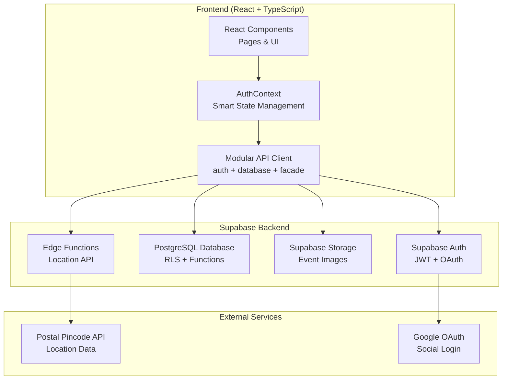
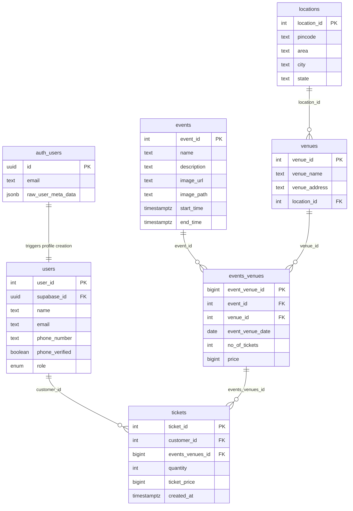

# Bookify - Event Booking Platform

Bookify is a modern, performant, and secure platform for discovering and booking tickets for events. Built with a modern tech stack, it provides a seamless user experience for both customers and administrators.

## 📖 Table of Contents

1. [Features](#-features)
2. [Tech Stack](#-tech-stack)
3. [Getting Started](#-getting-started)
4. [Architecture Overview](#-architecture-overview)
5. [API Documentation](#-api-documentation)
6. [Deployment Guide](#-deployment-guide)
7. [Testing Strategy](#-testing-strategy)
8. [Local Workflows](#-local-workflows)
9. [Changelog](#-changelog)

---

## ✨ Features

- **Event Discovery:** Browse, search, and filter a wide range of events.
- **Secure Booking:** A reliable and secure ticket booking process.
- **User Authentication:** Email/password and Google OAuth for seamless login.
- **Admin Panel:** Manage events, venues, and bookings with a dedicated admin interface.
- **User Profiles:** Users can manage their profiles and view their booking history.

---

## 🛠️ Tech Stack

- **Frontend:** React, TypeScript, Vite, Tailwind CSS
- **Backend:** Supabase (PostgreSQL, Auth, Storage, Edge Functions)
- **Testing:** Vitest, React Testing Library
- **Deployment:** Vercel

---

## 🚀 Getting Started

### Prerequisites

- Node.js (v18 or higher)
- npm
- Supabase CLI

### Installation

1. **Clone the repository:**

   ```bash
   git clone https://github.com/jaipkapoor99/bookify.git
   cd bookify
   ```

2. **Install dependencies:**

   ```bash
   npm install
   ```

3. **Set up your environment:**
   - Copy `.env.example` to `.env.local`.
   - Fill in your Supabase project URL and anon key.

4. **Start the development server:**

   ```bash
   npm run dev
   ```

---

## 🏗️ Architecture Overview

This section provides a comprehensive overview of Bookify's architecture, design decisions, and system components.

### High-Level Architecture



### Design Principles

- **Security First:** RLS, JWT, and input validation are used throughout.
- **Performance Optimization:** Caching, lazy loading, and database optimization are key.
- **Maintainability:** TypeScript, a component-based architecture, and clear separation of concerns are prioritized.
- **Scalability:** A stateless design, database functions, and edge functions allow for horizontal scaling.

---

## 🌐 API Documentation

This section provides comprehensive documentation for Bookify's backend API, database functions, and data structures.

### Database Schema

The database follows a normalized relational design with proper foreign key constraints.



### Database Functions

- `book_ticket(p_event_venue_id, p_quantity)`: Books tickets for a specific event-venue combination.
- `get_my_bookings()`: Retrieves all bookings for the currently authenticated user.
- `create_user_profile()`: Trigger function that creates a user profile when a new account is created.

### Edge Functions

- `get-location-from-pincode`: Fetches location details from an Indian postal pincode.

---

## 🚀 Deployment Guide

This guide covers deploying Bookify to production environments.

### Pre-Deployment Setup

1. **Environment Variables:** Create production environment variables for Supabase URL and anon key.
2. **Supabase Production Setup:** Create a new Supabase project, run migrations, and set up RLS policies, authentication providers, and storage buckets.

### Vercel Deployment (Recommended)

1. **Connect Repository:** Use the Vercel CLI to connect and deploy your repository.
2. **Environment Variables:** Add your Supabase environment variables to the Vercel dashboard.
3. **Build Configuration:** Use the `@vercel/static-build` preset for Vite.

---

## 🧪 Testing Strategy

Bookify follows a comprehensive testing strategy ensuring reliability, performance, and user experience.

### Testing Philosophy

- **Test-Driven Development (TDD):** Write failing tests first, implement minimal code to pass, then refactor.
- **Testing Pyramid:** A strong base of unit tests, a smaller number of integration tests, and a few end-to-end tests.

### Testing Tools & Setup

- **Test Runner:** Vitest
- **Testing Library:** React Testing Library
- **Mocking:** Vitest mocks

---

## Local Workflows

This project includes scripts to run all GitHub Actions workflows locally, ensuring your code is safe to push to the remote repository.

### Quick Start

```bash
# Run all workflows (Windows/PowerShell)
npm run workflows

# Quick run (skip non-essential checks)
npm run workflows:quick

# Run all workflows (Linux/macOS/Bash)
npm run workflows:bash
```

---

## 📜 Changelog

### [1.6.5] - 2025-01-17

- **Fixed:** Slow navigation to "My Bookings" page.
- **Added:** Optimized database function `get_my_bookings_with_details()`.
- **Added:** Optimistic UI updates for instant navigation.
- **Changed:** Enhanced `AuthContext` with optimistic update capabilities.

### [1.6.4] - 2025-01-17

- **Fixed:** Double currency symbol issue in `EventDetailPage`.

### [1.6.3] - 2025-01-17

- **Fixed:** Critical Supabase module import error.
- **Fixed:** Test environment compatibility issues.
- **Changed:** Optimized Vite configuration for dependency pre-bundling.

_(For a full history, see the `git log`)_
