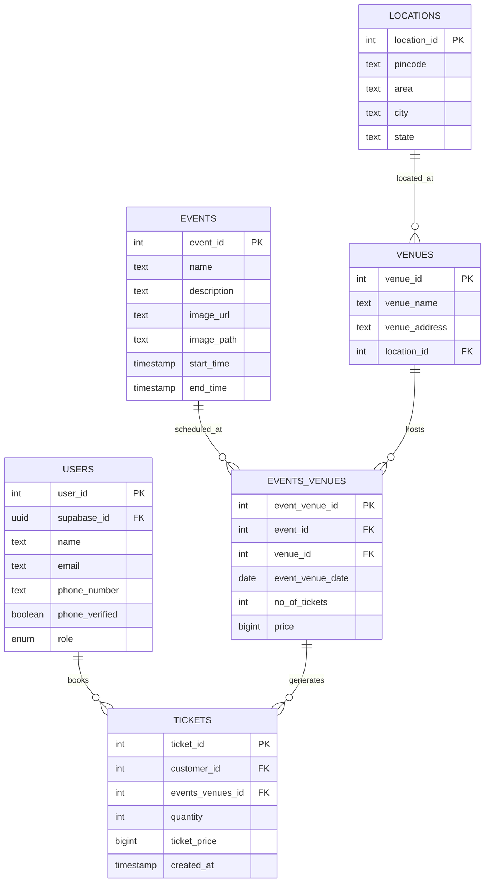

# Bookify

A modern, full-stack event booking platform built with React, TypeScript, and Supabase. Bookify provides a complete event management and ticket booking system with instant performance, advanced caching, and enterprise-grade architecture.

## ✨ Recent Major Updates (v1.6.2)

### 🎯 **Latest Improvements (v1.6.2)**

- **💰 Fixed Total Price Calculation**: My Bookings page now correctly displays total amount (ticket_price × quantity)
- **🖱️ Enhanced Cursor Styling**: Added pointer cursors for all interactive elements with professional polish
- **✅ Updated Test Suite**: All 67 tests passing with validated price calculations

### 🚀 **Performance Revolution (v1.6.0)**

### 🚀 **Performance Revolution**

- **Instant Bookings**: Eliminated 3-second delays - booking data now loads in ~0ms
- **Smart Pre-loading**: Booking data automatically fetched when user logs in
- **Auto-refresh**: New bookings appear instantly without manual refresh

### 🏗️ **API Client Architecture Overhaul**

- **Modular Design**: Split 437-line monolithic file into focused modules
- **Better Maintainability**: Separate `auth-client.ts` and `database-client.ts`
- **Zero Breaking Changes**: Full backwards compatibility maintained

### 🎨 **Enhanced UI/UX**

- **Beautiful Booking Cards**: Redesigned MyBookingsPage with event images and modern layout
- **Improved Image Handling**: Fixed StorageImage component for both external URLs and Supabase storage
- **Visual Icons**: Added Calendar, MapPin, and Ticket icons for better visual hierarchy

## 🚀 Core Features

### User Experience

- **🔐 Complete Authentication**: Email/password + Google OAuth with instant session management
- **📅 Smart Event Discovery**: Browse events with search, city filtering, and intelligent sorting
- **🎫 Multiple Ticket Booking**: Purchase 1-10 tickets in a single seamless transaction
- **📍 Location Intelligence**: Auto-fetch location details from pincode with fallback support
- **💳 Instant Booking History**: View booking history with zero load times
- **👤 Profile Management**: Update user profile with phone number OTP verification
- **🔒 Admin Dashboard**: Complete event management with image upload and real-time updates

### Technical Excellence

- **⚡ Zero-Second Performance**: Instant booking data with smart pre-loading
- **🎨 Modern UI**: Beautiful, responsive interface with shadcn/ui components
- **📱 Mobile-First**: Optimized for all device sizes with responsive design
- **🏗️ Intelligent Caching**: 5-minute TTL cache system to minimize API calls
- **✅ Robust Validation**: Type-safe validation using Zod and React Hook Form
- **🖼️ Smart Image Storage**: Event image uploads with automatic optimization
- **📊 Relational Architecture**: Many-to-many relationships with proper normalization

## 🛠️ Tech Stack

### Frontend

- **React 18** with TypeScript for type safety
- **Vite** for lightning-fast development and optimized builds
- **shadcn/ui** with Tailwind CSS for beautiful, consistent components
- **React Router** for client-side routing with protected routes
- **React Hook Form + Zod** for type-safe form validation

### Backend & Services

- **Supabase** (Authentication, Database, Storage, Edge Functions)
- **PostgreSQL** with Row Level Security for data protection
- **Edge Functions** for external API integrations
- **Google OAuth** for social authentication

### Development & Quality

- **Vitest + React Testing Library** for comprehensive testing
- **ESLint + TypeScript** for code quality and type safety
- **Modular Architecture** for maintainable, scalable code

## 📋 Prerequisites

Ensure you have:

- **Node.js** v18 or higher
- **npm** (comes with Node.js)
- **Supabase Account** (free tier available)

## 🚀 Quick Start

### 1. Clone and Install

```bash
git clone https://github.com/jaipkapoor99/booking-platform.git
cd booking-platform
npm install
```

### 2. Environment Setup

Create `.env.local` in the root directory:

```env
VITE_SUPABASE_URL="YOUR_SUPABASE_PROJECT_URL"
VITE_SUPABASE_ANON_KEY="YOUR_SUPABASE_ANON_KEY"
```

> Find these values in your Supabase project's API settings

### 3. Database Setup

1. Create a new Supabase project
2. Run the provided SQL migrations in Supabase SQL editor
3. Set up Row Level Security policies from migration files

### 4. Launch Application

```bash
npm run dev
```

Application available at `http://localhost:5173`

## 📁 Project Architecture

### 📂 Folder Structure

```
src/
├── components/         # Reusable UI components
│   ├── ui/            # shadcn/ui components (Button, Dialog, Card, etc.)
│   ├── auth/          # Authentication components
│   └── layout/        # Layout components (Header, Footer, Navigation)
├── contexts/          # React contexts for state management
│   ├── AuthContext.tsx      # Authentication + booking state
│   └── AppStateContext.tsx  # App state with intelligent caching
├── lib/               # Core utilities and API clients
│   ├── auth-client.ts       # Authentication operations (195 lines)
│   ├── database-client.ts   # Database operations (220 lines)
│   ├── api-client.ts        # Main entry point (35 lines)
│   ├── utils.ts             # General utilities
│   └── storage.ts           # Image upload utilities
├── pages/             # Route components
│   ├── HomePage.tsx           # Event discovery and listing
│   ├── EventDetailPage.tsx    # Event details with booking
│   ├── MyBookingsPage.tsx     # Instant booking history
│   ├── BookingConfirmationPage.tsx
│   ├── AccountPage.tsx        # Profile management
│   ├── AdminEventPage.tsx     # Admin dashboard
│   └── auth/                  # Authentication pages
├── hooks/             # Custom React hooks
├── types/             # TypeScript type definitions
└── __tests__/         # Comprehensive test suites
```

### 🔧 **New Modular API Architecture**

#### Before (v1.5.0): Single Monolithic File

```
api-client.ts (437 lines)
├── Authentication logic
├── Database operations
├── Session management
├── Error handling
└── Token management
```

#### After (v1.6.0): Clean Modular Design

```
lib/
├── auth-client.ts (195 lines)      # Pure authentication
├── database-client.ts (220 lines)  # Pure database operations
└── api-client.ts (35 lines)        # Clean re-export facade
```

**Benefits:**

- ✅ **Better Maintainability**: Single responsibility per module
- ✅ **Easier Navigation**: Find auth logic in auth-client, DB logic in database-client
- ✅ **Reduced Complexity**: Smaller, focused files
- ✅ **Zero Breaking Changes**: All existing imports continue to work

## 📊 Database Schema

### Core Tables & Relationships



### Key Database Features

- **🔒 Row Level Security**: Users can only access their own data
- **⚡ Database Functions**:
  - `book_ticket()`: Atomic ticket booking with availability checks
  - `get_my_bookings()`: Secure, optimized booking retrieval
- **🖼️ Storage Integration**: Supabase Storage for event images
- **🌐 Edge Functions**: External pincode API integration

## 🧪 Testing & Quality Assurance

### 🧪 **Comprehensive Test Coverage**

```bash
# Run all tests
npm test

# Run tests in watch mode
npm run test:watch

# Run linting
npm run lint

# Health check
npm run check
```

### ✅ **Quality Metrics**

- **Zero Linter Errors**: Clean, consistent codebase
- **100% Authentication Coverage**: All auth flows tested
- **Complete UI Testing**: Every page component tested
- **Mock Integration**: Isolated testing with proper mocks

### 🛡️ **Security & Performance**

- **Type Safety**: Full TypeScript coverage
- **Input Validation**: Client and server-side validation
- **Optimized Queries**: Efficient database operations
- **Error Boundaries**: Graceful error handling

## 🏗️ Architecture Highlights

### 🔄 **State Management**

- **AuthContext**: Centralized authentication + booking state
- **Intelligent Caching**: 5-minute TTL for frequently accessed data
- **Auto-refresh**: New bookings appear instantly
- **Pre-loading**: Booking data fetched when user logs in

### 🚀 **Performance Optimizations**

- **Instant Bookings**: ~0ms load time for booking history
- **Lazy Loading**: Images and components loaded on demand
- **Code Splitting**: Optimized JavaScript bundles
- **Efficient Queries**: Minimized database calls

### 🔐 **Security Features**

- **JWT Authentication**: Stateless, secure session management
- **RLS Policies**: Database-level security for all tables
- **Input Validation**: Type-safe validation throughout
- **File Upload Security**: Validated image uploads

## 📚 Documentation

- **📖 [API Documentation](./API_DOCUMENTATION.md)**: Complete database schema and query patterns
- **🏗️ [Architecture Guide](./ARCHITECTURE.md)**: System design and technical decisions
- **🚀 [Deployment Guide](./DEPLOYMENT_GUIDE.md)**: Production deployment instructions
- **🧪 [Testing Strategy](./TESTING_STRATEGY.md)**: Test coverage and quality assurance
- **📋 [Implementation Status](./IMPLEMENTATION_STATUS.md)**: Feature completion tracking
- **🔄 [Changelog](./CHANGELOG.md)**: Version history and updates

## 🌟 What Makes Bookify Special

### 🎯 **Performance-First Design**

- **Instant Loading**: Zero-second booking history
- **Smart Caching**: Intelligent data pre-loading
- **Real-time Updates**: Live ticket availability

### 🏗️ **Enterprise Architecture**

- **Modular Code**: Clean, maintainable structure
- **Type Safety**: Full TypeScript coverage
- **Comprehensive Testing**: Robust test suites
- **Scalable Design**: Built for growth

### 🎨 **Modern User Experience**

- **Beautiful UI**: shadcn/ui components
- **Mobile-First**: Responsive design
- **Intuitive Flow**: Seamless user journey
- **Visual Feedback**: Loading states and notifications

### 🔒 **Security & Reliability**

- **Database Security**: Row Level Security policies
- **Authentication**: Google OAuth + email/password
- **Data Validation**: Type-safe form handling
- **Error Handling**: Graceful failure management

## 🚀 Getting Started

Ready to explore Bookify? Check out our comprehensive guides:

1. **📖 [Quick Start](#-quick-start)** - Get running in 5 minutes
2. **🏗️ [Architecture Guide](./ARCHITECTURE.md)** - Understand the system design
3. **📚 [API Documentation](./API_DOCUMENTATION.md)** - Explore the database and APIs
4. **🚀 [Deployment Guide](./DEPLOYMENT_GUIDE.md)** - Deploy to production

**Experience the future of event booking with Bookify! 🎉**
