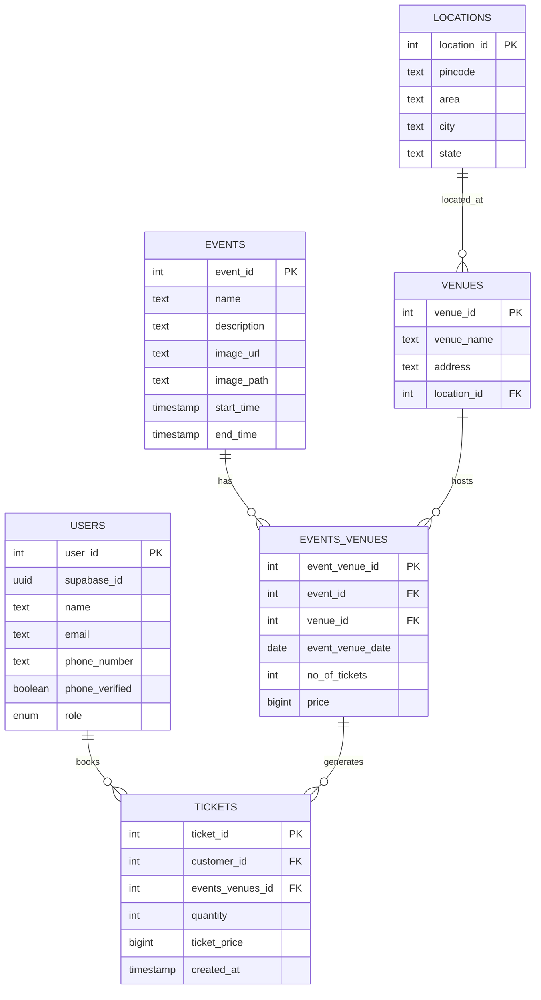

# Bookify

A modern, full-stack event booking platform built with React, TypeScript, and Supabase. Bookify provides a complete event management and ticket booking system with authentication, real-time availability, and admin capabilities.

## 🚀 Features

### Core Functionality

- **🔐 User Authentication**: Complete auth system with email/password and Google OAuth
- **📅 Event Discovery**: Browse events with search, filtering by city, and sorting options
- **🎫 Multiple Ticket Booking**: Purchase 1-10 tickets in a single transaction
- **📍 Location-Based Filtering**: Events filtered by location with pincode integration
- **💳 Booking Management**: View booking history and manage ticket purchases
- **👤 Profile Management**: Update user profile, phone number with OTP verification
- **🔒 Admin Panel**: Create, edit, delete events with image upload functionality

### Technical Features

- **⚡ Real-time Updates**: Live ticket availability checking
- **🎨 Modern UI**: Beautiful, responsive interface with shadcn/ui components
- **📱 Mobile Responsive**: Optimized for all device sizes
- **🏗️ State Management**: Efficient caching system (5-minute TTL) to minimize API calls
- **✅ Form Validation**: Robust validation using Zod and React Hook Form
- **🖼️ Image Storage**: Event image uploads via Supabase Storage
- **📊 Database Relations**: Many-to-many relationship between events and venues

## 🛠️ Tech Stack

- **Frontend**: React 18, TypeScript, Vite
- **UI Components**: shadcn/ui, Tailwind CSS, Lucide React Icons
- **Backend**: Supabase (Auth, Database, Storage, Edge Functions)
- **State Management**: React Context API with caching
- **Form Handling**: React Hook Form + Zod validation
- **Testing**: Vitest, React Testing Library
- **Build Tool**: Vite
- **Package Manager**: npm

## 📋 Prerequisites

Before you begin, ensure you have:

- **Node.js** (v18 or higher)
- **npm** (usually comes with Node.js)
- **Supabase Account** (free tier available)

## 🚦 Quick Start

### 1. Clone and Install

```bash
git clone https://github.com/jaipkapoor99/booking-platform.git
cd booking-platform
npm install
```

### 2. Environment Setup

Create a `.env.local` file in the root directory:

```env
VITE_SUPABASE_URL="YOUR_SUPABASE_PROJECT_URL"
VITE_SUPABASE_ANON_KEY="YOUR_SUPABASE_ANON_KEY"
```

> **Important**: You can find these values in your Supabase project's API settings. Restart the development server after creating this file.

### 3. Database Setup

1. Create a new Supabase project
2. Run the provided SQL migrations in your Supabase SQL editor
3. Set up Row Level Security (RLS) policies as defined in the migration files

### 4. Run the Application

```bash
npm run dev
```

The application will be available at `http://localhost:5173`

## 📁 Project Structure

```
src/
├── components/         # Reusable UI components
│   ├── ui/            # shadcn/ui components (Button, Dialog, etc.)
│   ├── auth/          # Authentication components
│   └── layout/        # Layout components (Header, Footer)
├── contexts/          # React contexts
│   ├── AuthContext.tsx      # Authentication state
│   └── AppStateContext.tsx  # App state with caching
├── hooks/             # Custom React hooks
├── lib/               # Utility functions
│   ├── utils.ts       # General utilities
│   └── storage.ts     # Image upload utilities
├── pages/             # Page components
│   ├── HomePage.tsx           # Event listing
│   ├── EventDetailPage.tsx    # Event details
│   ├── BookingConfirmationPage.tsx
│   ├── MyBookingsPage.tsx     # User's bookings
│   ├── AccountPage.tsx        # Profile management
│   ├── AdminEventPage.tsx     # Admin panel
│   ├── LoginPage.tsx
│   └── SignupPage.tsx
├── types/             # TypeScript type definitions
└── SupabaseClient.ts  # Supabase configuration
```

## 📊 Database Schema

The application uses a relational database with the following key tables:



### Key Database Features

- **Many-to-Many Relations**: Events can occur at multiple venues on different dates
- **Row Level Security (RLS)**: Users can only access their own data
- **Database Functions**:
  - `book_ticket()`: Handles ticket booking with availability checks
  - `get_my_bookings()`: Securely fetches user's bookings
- **Storage Integration**: Supabase Storage for event images
- **Edge Functions**: Location data fetched from pincode API

## 🧪 Testing & Quality

### Running Tests

```bash
# Run all tests
npm test

# Run tests in watch mode
npm run test:watch

# Run linting
npm run lint

# Run comprehensive health check
npm run check
```

### Test Coverage

The project includes comprehensive test suites for:

- Authentication flows
- Event browsing and filtering
- Booking confirmation process
- User profile management
- Admin event management

## 📝 Available Scripts

| Script            | Description                            |
| ----------------- | -------------------------------------- |
| `npm run dev`     | Start development server               |
| `npm run build`   | Build for production                   |
| `npm run preview` | Preview production build               |
| `npm test`        | Run test suite                         |
| `npm run lint`    | Run ESLint                             |
| `npm run check`   | Run comprehensive project health check |

## 🔧 Configuration Files

- `vite.config.ts` - Vite configuration with React and Tailwind
- `tsconfig.json` - TypeScript configuration
- `tailwind.config.js` - Tailwind CSS configuration
- `components.json` - shadcn/ui components configuration
- `vitest.config.ts` - Testing configuration

## 🌐 Key Features Deep Dive

### Authentication System

- **Email/Password**: Traditional signup and login
- **Google OAuth**: Social authentication integration
- **Session Management**: Automatic session handling with Supabase
- **Profile Management**: Update name, phone number with OTP verification

### Event Management

- **Multi-Venue Support**: Single event can occur at multiple venues
- **Date Flexibility**: Different dates for different venues
- **Image Upload**: Event images stored in Supabase Storage
- **Admin Controls**: Full CRUD operations for events

### Booking System

- **Quantity Selection**: Book 1-10 tickets per transaction
- **Real-time Availability**: Live ticket count updates
- **Booking History**: Complete purchase history for users
- **Price Management**: Flexible pricing per event-venue combination

### State Management

- **Caching Layer**: 5-minute TTL cache to reduce API calls
- **Loading States**: Comprehensive loading state management
- **Error Handling**: Robust error handling throughout the app

## 🔐 Security Features

- **Row Level Security**: Database-level access control
- **JWT Authentication**: Secure token-based authentication
- **Input Validation**: Client and server-side validation
- **File Upload Security**: Type and size validation for images
- **SQL Injection Protection**: Parameterized queries and RPC functions

## 🚀 Deployment

### Environment Variables for Production

```env
VITE_SUPABASE_URL=your_production_supabase_url
VITE_SUPABASE_ANON_KEY=your_production_anon_key
```

### Build Process

```bash
npm run build
```

The build output will be in the `dist/` directory, ready for deployment to any static hosting service.

## 🔄 Recent Updates

See [CHANGELOG.md](./CHANGELOG.md) for detailed version history.

### Latest Features (v1.4.0)

- Google OAuth integration
- Account management page with phone verification
- Enhanced user profile system
- Improved protected routes structure

## 🐛 Troubleshooting

### Common Issues

1. **Environment Variables Not Loading**

   - Ensure `.env.local` file exists in root directory
   - Restart development server after creating/modifying `.env.local`

2. **Database Connection Issues**

   - Verify Supabase URL and API key
   - Check if RLS policies are properly configured

3. **Image Upload Failures**

   - Ensure Supabase Storage bucket exists
   - Check file size (max 5MB) and type restrictions

4. **OAuth Not Working**
   - Configure OAuth providers in Supabase dashboard
   - Add redirect URLs for your domain

## 🤝 Contributing

1. Fork the repository
2. Create a feature branch: `git checkout -b feature/amazing-feature`
3. Commit your changes: `git commit -m 'Add amazing feature'`
4. Push to the branch: `git push origin feature/amazing-feature`
5. Open a Pull Request

## 📄 License

This project is licensed under the MIT License - see the LICENSE file for details.

## 📞 Support

For support and questions:

- Create an issue in the GitHub repository
- Check the [IMPLEMENTATION_STATUS.md](./IMPLEMENTATION_STATUS.md) for feature status
- Review the [CHANGELOG.md](./CHANGELOG.md) for recent changes

---

Built with ❤️ using modern web technologies
