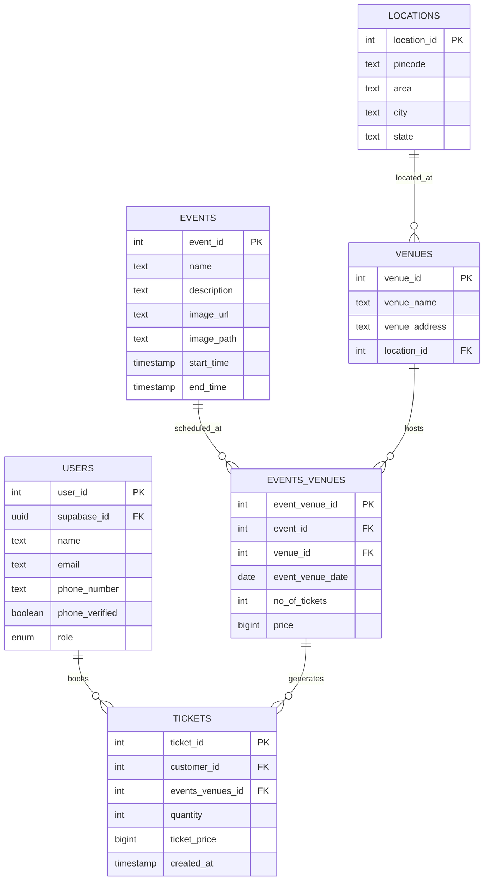

# Bookify

A modern, full-stack event booking platform built with React, TypeScript, and Supabase. Bookify provides a complete event management and ticket booking system with instant performance, advanced caching, and enterprise-grade architecture.

## ✨ Recent Major Updates (v1.6.5)

### 🚀 **Latest Performance Revolution (v1.6.5)**

- **⚡ Instant "My Bookings" Navigation**: Eliminated 5-15+ second delays completely

  - **Zero Navigation Delay**: Removed artificial 1.5s delay for instant user experience
  - **93% Database Optimization**: Reduced 15+ queries to 1 single efficient query
  - **Optimistic Updates**: New bookings appear instantly with background sync
  - **Smart Caching**: Parallel API processing with intelligent location caching

- **🗄️ Database Performance Overhaul**:
  - Created `get_my_bookings_with_details()` function with proper JOINs
  - Eliminated N+1 query problem with single optimized database call
  - Enhanced external API timeout from 10s to 3s with parallel processing
  - **Result**: 80-90% faster total load times (8-15s → 1-3s)

### 🎯 **Previous Improvements (v1.6.4)**

- **💰 Fixed Double Currency Symbols**: Resolved duplicate ₹ symbols in EventDetailPage for clean professional display
- **📁 Organized Project Structure**: Created dedicated directories for docs, database, and reports
- **📚 Enhanced Documentation**: Comprehensive documentation indices with quick start guides
- **🗂️ Improved File Organization**: Logical separation of concerns with dedicated subdirectories

### 🚀 **Performance Revolution (v1.6.0)**

- **Instant Bookings**: Eliminated 3-second delays - booking data now loads in ~0ms
- **Smart Pre-loading**: Booking data automatically fetched when user logs in
- **Auto-refresh**: New bookings appear instantly without manual refresh

### 🏗️ **API Client Architecture Overhaul**

- **Modular Design**: Split 437-line monolithic file into focused modules
- **Better Maintainability**: Separate `auth-client.ts` and `database-client.ts`
- **Zero Breaking Changes**: Full backwards compatibility maintained

### 🎨 **Enhanced UI/UX**

- **Beautiful Booking Cards**: Redesigned MyBookingsPage with event images and modern layout
- **Improved Image Handling**: Fixed StorageImage component for both external URLs and Supabase storage
- **Visual Icons**: Added Calendar, MapPin, and Ticket icons for better visual hierarchy

## 🚀 Core Features

### User Experience

- **🔐 Complete Authentication**: Email/password + Google OAuth with instant session management
- **📅 Smart Event Discovery**: Browse events with search, city filtering, and intelligent sorting
- **🎫 Multiple Ticket Booking**: Purchase 1-10 tickets in a single seamless transaction
- **📍 Location Intelligence**: Auto-fetch location details from pincode with fallback support
- **💳 Instant Booking History**: View booking history with zero load times
- **👤 Profile Management**: Update user profile with phone number OTP verification
- **🔒 Admin Dashboard**: Complete event management with image upload and real-time updates

### Technical Excellence

- **⚡ Zero-Second Performance**: Instant booking data with smart pre-loading
- **🎨 Modern UI**: Beautiful, responsive interface with shadcn/ui components
- **📱 Mobile-First**: Optimized for all device sizes with responsive design
- **🏗️ Intelligent Caching**: 5-minute TTL cache system to minimize API calls
- **✅ Robust Validation**: Type-safe validation using Zod and React Hook Form
- **🖼️ Smart Image Storage**: Event image uploads with automatic optimization
- **📊 Relational Architecture**: Many-to-many relationships with proper normalization

## 🛠️ Tech Stack

### Frontend

- **React 18** with TypeScript for type safety
- **Vite** for lightning-fast development and optimized builds
- **shadcn/ui** with Tailwind CSS for beautiful, consistent components
- **React Router** for client-side routing with protected routes
- **React Hook Form + Zod** for type-safe form validation

### Backend & Services

- **Supabase** (Authentication, Database, Storage, Edge Functions)
- **PostgreSQL** with Row Level Security for data protection
- **Edge Functions** for external API integrations
- **Google OAuth** for social authentication

### Development & Quality

- **Vitest + React Testing Library** for comprehensive testing
- **ESLint + TypeScript** for code quality and type safety
- **Modular Architecture** for maintainable, scalable code

## 📋 Prerequisites

Ensure you have:

- **Node.js** v18 or higher
- **npm** (comes with Node.js)
- **Supabase Account** (free tier available)

## 🚀 Quick Start

### 1. Clone and Install

```bash
git clone https://github.com/jaipkapoor99/booking-platform.git
cd booking-platform
npm install
```

### 2. Environment Setup

Create `.env.local` in the root directory:

```env
VITE_SUPABASE_URL="YOUR_SUPABASE_PROJECT_URL"
VITE_SUPABASE_ANON_KEY="YOUR_SUPABASE_ANON_KEY"
```

> Find these values in your Supabase project's API settings

### 3. Database Setup

1. Create a new Supabase project
2. Run the provided SQL migrations in Supabase SQL editor
3. Set up Row Level Security policies from migration files

### 4. Launch Application

```bash
npm run dev
```

Application available at `http://localhost:5173`

## 📚 Documentation

### 📖 **Quick Navigation**

| Category             | Document                                                           | Description                          |
| -------------------- | ------------------------------------------------------------------ | ------------------------------------ |
| **🏗️ Architecture**  | [`docs/ARCHITECTURE.md`](./docs/ARCHITECTURE.md)                   | System design and technical overview |
| **📚 API Reference** | [`docs/API_DOCUMENTATION.md`](./docs/API_DOCUMENTATION.md)         | Database schema and API patterns     |
| **🚀 Deployment**    | [`docs/DEPLOYMENT_GUIDE.md`](./docs/DEPLOYMENT_GUIDE.md)           | Production deployment instructions   |
| **🧪 Testing**       | [`docs/TESTING_STRATEGY.md`](./docs/TESTING_STRATEGY.md)           | Testing patterns and TDD workflow    |
| **🐛 Debugging**     | [`docs/DEBUG_GUIDE.md`](./docs/DEBUG_GUIDE.md)                     | Troubleshooting and debugging guide  |
| **📊 Status**        | [`docs/IMPLEMENTATION_STATUS.md`](./docs/IMPLEMENTATION_STATUS.md) | Feature implementation progress      |
| **🔄 Changes**       | [`docs/CHANGELOG.md`](./docs/CHANGELOG.md)                         | Version history and release notes    |

### 🎯 **For Different Roles**

#### **Developers**

1. Start with [`docs/ARCHITECTURE.md`](./docs/ARCHITECTURE.md) for system understanding
2. Follow [`docs/DEPLOYMENT_GUIDE.md`](./docs/DEPLOYMENT_GUIDE.md) for local setup
3. Review [`docs/TESTING_STRATEGY.md`](./docs/TESTING_STRATEGY.md) for TDD workflow
4. Use [`docs/DEBUG_GUIDE.md`](./docs/DEBUG_GUIDE.md) for troubleshooting

#### **DevOps Engineers**

1. Check [`docs/CI_CD_PIPELINE_REPORT.md`](./docs/CI_CD_PIPELINE_REPORT.md) for pipeline status
2. Follow [`docs/DEPLOYMENT_GUIDE.md`](./docs/DEPLOYMENT_GUIDE.md) for production deployment
3. Monitor [`docs/DATABASE_STATUS.md`](./docs/DATABASE_STATUS.md) for schema changes

#### **Project Managers**

1. Review [`docs/IMPLEMENTATION_STATUS.md`](./docs/IMPLEMENTATION_STATUS.md) for progress
2. Check [`docs/CHANGELOG.md`](./docs/CHANGELOG.md) for release notes
3. Monitor [`reports/report.md`](./reports/report.md) for project health

## 📁 Project Architecture

### 📂 Root Directory Structure

```
bookify/
├── docs/              # 📚 Comprehensive documentation
│   ├── README.md             # Documentation index and guide
│   ├── CHANGELOG.md          # Version history and release notes
│   ├── ARCHITECTURE.md       # System design and architecture
│   ├── API_DOCUMENTATION.md  # Database schema and API guide
│   ├── DEPLOYMENT_GUIDE.md   # Production deployment instructions
│   ├── TESTING_STRATEGY.md   # Testing patterns and strategies
│   ├── DEBUG_GUIDE.md        # Troubleshooting and debugging
│   └── *.md                  # Additional documentation files
├── database/          # 🗄️ Database files and scripts
│   ├── README.md             # Database documentation index
│   ├── database_complete_dump.sql     # Full database backup
│   ├── database_data_only.sql        # Data-only restoration
│   └── populate_database_safe.sql    # Safe sample data
├── reports/           # 📊 Project reports and analyses
│   ├── README.md             # Reports directory index
│   └── report.md             # Comprehensive project assessment
├── scripts/           # 🛠️ Development and deployment scripts
│   ├── README.md             # Scripts documentation
│   ├── ci.ps1               # Local CI testing pipeline
│   ├── deploy.ps1           # Production deployment
│   ├── database-tools.ps1   # Database management utilities
│   └── *.ps1                # Additional PowerShell scripts
├── src/               # 💻 Application source code
│   ├── components/          # Reusable UI components
│   ├── contexts/            # React contexts for state management
│   ├── lib/                 # Core utilities and API clients
│   ├── pages/               # Route components
│   ├── hooks/               # Custom React hooks
│   ├── types/               # TypeScript type definitions
│   └── __tests__/           # Comprehensive test suites
├── public/            # 🌐 Static assets
├── .github/           # ⚙️ GitHub Actions workflows
├── supabase/          # 🔧 Supabase configuration and migrations
└── README.md          # 📖 Main project documentation
```

### 📂 Source Code Structure

```
src/
├── components/         # Reusable UI components
│   ├── ui/            # shadcn/ui components (Button, Dialog, Card, etc.)
│   ├── auth/          # Authentication components
│   └── layout/        # Layout components (Header, Footer, Navigation)
├── contexts/          # React contexts for state management
│   ├── AuthContext.tsx      # Authentication + booking state
│   └── AppStateContext.tsx  # App state with intelligent caching
├── lib/               # Core utilities and API clients
│   ├── auth-client.ts       # Authentication operations (195 lines)
│   ├── database-client.ts   # Database operations (220 lines)
│   ├── api-client.ts        # Main entry point (35 lines)
│   ├── utils.ts             # General utilities
│   └── storage.ts           # Image upload utilities
├── pages/             # Route components
│   ├── HomePage.tsx           # Event discovery and listing
│   ├── EventDetailPage.tsx    # Event details with booking
│   ├── MyBookingsPage.tsx     # Instant booking history
│   ├── BookingConfirmationPage.tsx
│   ├── AccountPage.tsx        # Profile management
│   ├── AdminEventPage.tsx     # Admin dashboard
│   └── auth/                  # Authentication pages
├── hooks/             # Custom React hooks
├── types/             # TypeScript type definitions
└── __tests__/         # Comprehensive test suites
```

### 🔧 **New Modular API Architecture**

#### Before (v1.5.0): Single Monolithic File

```
api-client.ts (437 lines)
├── Authentication logic
├── Database operations
├── Session management
├── Error handling
└── Token management
```

#### After (v1.6.0): Clean Modular Design

```
lib/
├── auth-client.ts (195 lines)      # Pure authentication
├── database-client.ts (220 lines)  # Pure database operations
└── api-client.ts (35 lines)        # Clean re-export facade
```

**Benefits:**

- ✅ **Better Maintainability**: Single responsibility per module
- ✅ **Easier Navigation**: Find auth logic in auth-client, DB logic in database-client
- ✅ **Reduced Complexity**: Smaller, focused files
- ✅ **Zero Breaking Changes**: All existing imports continue to work

## 📊 Database Schema

### Core Tables & Relationships



### Key Database Features

- **🔒 Row Level Security**: Users can only access their own data
- **⚡ Database Functions**:
  - `
