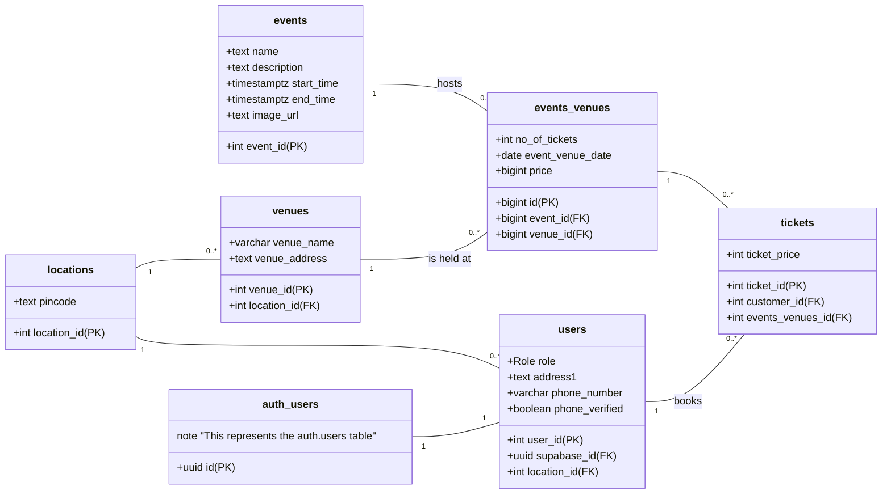

# Event Booking Platform

A modern event booking platform built with React, TypeScript, and Supabase.

## Features

- ✅ User authentication (signup/login)
- ✅ Browse events with filtering and search
- ✅ Book multiple tickets in one transaction
- ✅ View booking history
- ✅ Real-time ticket availability
- ✅ Location-based event filtering
- ✅ State management with caching
- ✅ Image storage support
- ✅ Form validation with Zod
- ✅ Modern UI with shadcn/ui components
- **User Authentication**: Sign up, log in, and manage sessions via Supabase.
- **Event Browsing**: View upcoming events with search, filtering by city, and sorting options.
- **Event Details**: Detailed view of events with venue information and multiple date options.
- **Ticket Booking**: Book multiple tickets (1-10) in a single transaction with real-time availability checking.
- **Booking History**: View all past and upcoming bookings with ticket quantities.
- **Profile Management**: Update user profile information.
- **Admin Event Management**: Create, edit, and delete events with image upload functionality.
- **State Management**: Efficient caching system to minimize API calls (5-minute TTL).
- **Modern UI**: Beautiful, responsive interface built with shadcn/ui components.
- **Form Validation**: Robust form validation using Zod and React Hook Form.
- **Image Storage**: Support for event image uploads using Supabase Storage.

## Prerequisites

- Node.js (v16 or higher)
- npm or yarn
- Supabase account

## Setup

1. Clone the repository
2. Install dependencies:
   ```bash
   npm install
   ```

3. Create a `.env` file based on `.env.example`:
   ```bash
   cp .env.example .env
   ```

4. Add your Supabase credentials to `.env`:
   ```
   VITE_SUPABASE_URL=your_supabase_project_url
   VITE_SUPABASE_ANON_KEY=your_supabase_anon_key
   ```

5. Run the development server:
   ```bash
   npm run dev
   ```

## Database Schema

The platform uses the following main tables:

- `users` - User profiles with authentication
- `events` - Event information
- `venues` - Venue details
- `events_venues` - Junction table for events at specific venues
- `tickets` - Booking records with quantity support
- `locations` - Location/address information

Recent updates include:
- Added `quantity` column to tickets table for multiple ticket purchases
- Added `image_path` column to events table for file storage
- Created storage bucket for event images

## Available Scripts

- `npm run dev` - Start development server
- `npm run build` - Build for production
- `npm run test` - Run tests
- `npm run lint` - Run ESLint
- `npm run preview` - Preview production build

## Technologies Used

- **Frontend**: React 18, TypeScript
- **Styling**: Tailwind CSS, shadcn/ui
- **State Management**: React Context API with caching
- **Form Handling**: React Hook Form + Zod
- **Backend**: Supabase (Auth, Database, Storage)
- **Build Tool**: Vite
- **Testing**: Vitest, React Testing Library

## Project Structure

```
src/
├── components/     # Reusable UI components
│   ├── ui/        # shadcn/ui components
│   ├── auth/      # Authentication components
│   └── layout/    # Layout components
├── contexts/      # React contexts (Auth, AppState)
├── hooks/         # Custom React hooks
├── lib/           # Utility functions
├── pages/         # Page components
└── SupabaseClient.ts # Supabase configuration
```

## Recent Updates

- ✅ Multiple ticket booking support
- ✅ State management with caching to reduce API calls
- ✅ Image file storage integration
- ✅ Enhanced UI with more shadcn components
- ✅ Zod form validation
- ✅ Toast notifications
- ✅ Improved error handling

## Key Features

- **User Authentication**: Secure sign-up and login functionality powered by Supabase Auth.
  - Supports email/password and Google (OAuth) sign-in.
- **Account Management**: A dedicated "Account Settings" page allows users to:
  - Update their full name.
  - Add and verify a phone number for their account.
- **Event Discovery**: Users can browse a list of events on the home page.
- **Detailed Event Views**: A dedicated page for each event, showcasing multiple dates and venues.
- **Booking Confirmation**: A dedicated page to review and confirm booking details before purchase.
- **My Bookings Page**: A user-specific page to view all past and upcoming bookings.
- **Test-Driven Development**: A strict TDD workflow ensures code quality and reliability.
- **Database Migrations**: Schema is managed via Supabase migrations located in the `supabase/migrations` directory.

## Tech Stack

- **Framework**: React (with Vite)
- **Language**: TypeScript
- **UI Components**: shadcn/ui
- **Backend & Database**: Supabase
- **Styling**: Tailwind CSS
- **Testing**: Vitest & React Testing Library
- **Package Manager**: npm

## Getting Started

### Prerequisites

- [Node.js](https://nodejs.org/) (v18 or higher)
- [npm](https://www.npmjs.com/) (usually comes with Node.js)
- [Supabase Account](https://supabase.com/) for deploying the backend.

### Local Development Setup

1.  **Clone the repository:**

    ```bash
    git clone https://github.com/jaipkapoor99/booking-platform.git
    cd booking-platform
    ```

2.  **Install dependencies:**

    ```bash
    npm install
    ```

3.  **Set up Supabase Environment Variables:**

    - Create a file named `.env.local` in the root of the project.
    - Add your Supabase Project URL and Anon Key to this file. You can find these in your Supabase project's API settings.
      ```env
      VITE_SUPABASE_URL="YOUR_SUPABASE_URL"
      VITE_SUPABASE_ANON_KEY="YOUR_SUPABASE_ANON_KEY"
      ```
    - **Important**: You must restart the Vite development server after creating or modifying this file.

4.  **Run the development server:**
    ```bash
    npm run dev
    ```
    The application will be available at `http://localhost:5173`.

## Project Health Check

This project includes a PowerShell script to ensure code quality and correctness. To run all checks (linting, TypeScript compilation, and tests), use:

```bash
npm run check
```

## Database Schema

The database is designed to support a many-to-many relationship between events and venues, allowing a single event (like a tour) to occur at multiple venues on different dates.



## Contributing

We welcome contributions! To ensure a smooth and consistent development process, please refer to the project's **Test-Driven Development (TDD)** workflow.

### Development Workflow: Test-Driven Development (TDD)

This project follows a strict **Test-Driven Development (TDD)** approach. Every new feature or bug fix must start with a failing test. The workflow is as follows:

1.  **Red**: Write a new test that captures the requirements of the new feature or the bug to be fixed. This test should fail because the implementation does not yet exist.
2.  **Green**: Write the simplest, most straightforward code possible to make the test pass.
3.  **Refactor**: Clean up and optimize the code you've just written while ensuring all tests continue to pass.

### Testing Rules & Conventions

- **Test Files**: All test files are located in `src/pages/__tests__/`.
- **Mocking**: External dependencies, such as the Supabase client and `react-router-dom` hooks, are mocked globally via `src/setupTests.ts` and `src/__mocks__/`.
- **Router Context**: Components that use `react-router-dom`'s `Link` or other navigation features must be wrapped in a `<MemoryRouter>` during testing.
- **Asynchronous Operations**: Use `waitFor` from React Testing Library to handle state updates after asynchronous operations.

### Coding Style

- **TypeScript**: The project is written entirely in TypeScript. Please adhere to the defined types and interfaces.
- **Path Aliases**: Use the `@/` alias for imports from the `src` directory (e.g., `import MyComponent from '@/components/MyComponent'`).
- **Linting**: The project uses ESLint for code quality. Please ensure your code follows the linting rules (`npm run lint`) before submitting a contribution.
- **Component Library**: We use `shadcn/ui` for UI components. Please familiarize yourself with its usage.

## Testing

Run the test suite:
```bash
npm test
```

## TypeScript Configuration

The project uses TypeScript with strict type checking and enhanced module resolution:

- **Module Resolution**: Configured with `moduleResolution: "bundler"` for optimal compatibility with Vite
- **Type Roots**: TypeScript looks for type declarations in `node_modules/@types` and `src/types`
- **Path Aliases**: `@/*` is configured to resolve to `src/*` for cleaner imports
- **Built-in Types**: Radix UI and Lucide React packages include their own TypeScript definitions, so no separate @types packages are needed
- **Strict Mode**: Full strict type checking is enabled for better type safety

## Troubleshooting

## Admin Features

### Event Management

Admins can access the event management page at `/admin/events` to:

- **Create Events**: Add new events with details including name, description, start/end times, and images
- **Edit Events**: Update existing event information and replace images
- **Delete Events**: Remove events and their associated images from storage
- **Image Upload**: Support for JPEG, PNG, and WebP formats (max 5MB)

The admin interface includes:
- Real-time form validation
- Image preview before upload
- Automatic image optimization and storage in Supabase Storage
- Toast notifications for user feedback
