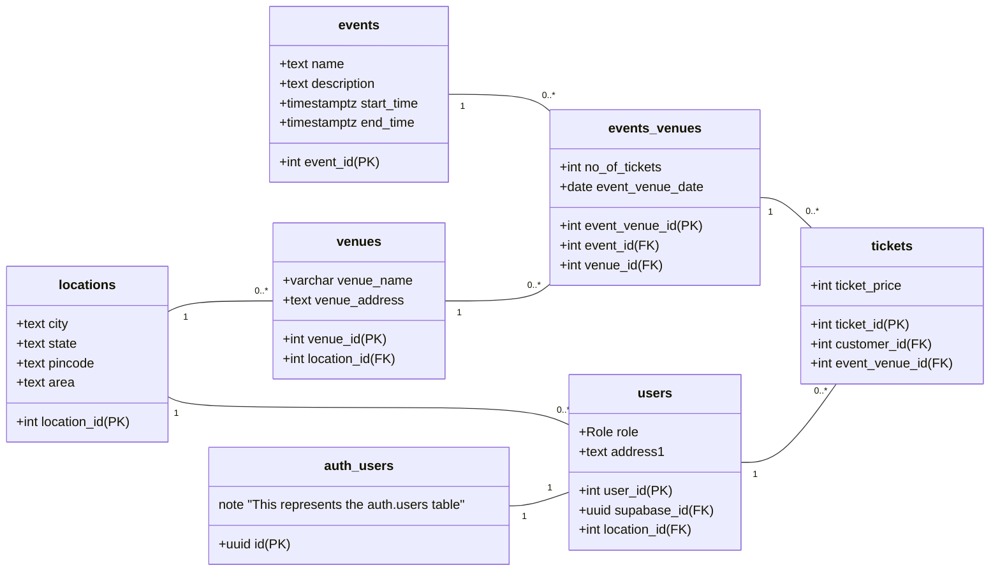

# Booking Platform

A modern, scalable booking platform built with React and Supabase. This application provides a seamless experience for users to book tickets and a powerful admin portal for easy management.

## Features

- **User Authentication**: Secure sign-up and login functionality.
- **Ticket Booking**: A user-friendly interface for browsing and booking tickets.
- **Admin Portal**: A dedicated dashboard for administrators to manage bookings, users, and available items.

## Tech Stack

- **Frontend**: React (via Vite)
- **UI Components**: shadcn/ui
- **Backend & Database**: Supabase
- **Styling**: Tailwind CSS
- **Testing**: Vitest & React Testing Library
- **Package Manager**: npm

## Getting Started

### Prerequisites

- Node.js (v18 or higher)
- npm

### Installation & Setup

1.  **Clone the repository:**

    ```bash
    git clone https://github.com/jaipkapoor99/booking-platform.git
    cd booking-platform
    ```

2.  **Install dependencies:**

    ```bash
    npm install
    ```

3.  **Set up Supabase:**

    - Create a `.env.local` file in the root of the project.
    - Add your Supabase Project URL and Anon Key to the `.env.local` file:
      ```env
      VITE_SUPABASE_URL=YOUR_SUPABASE_URL
      VITE_SUPABASE_ANON_KEY=YOUR_SUPABASE_ANON_KEY
      ```

4.  **Run the development server:**
    ```bash
    npm run dev
    ```

## Database Schema

The database schema is managed via Supabase migrations and is located in the `supabase/migrations` directory.



## Frontend Architecture Plan

This is a high-level blueprint for the application's design.

### 1. Page & Component Structure

- **Pages (`src/pages/`)**: `Home`, `AllEvents`, `EventDetails`, `MyBookings` (protected), `SignIn`, `SignUp`, and `NotFound`.
- **Reusable Components (`src/components/`)**:
  - **Layout**: `Layout` (with Sidebar), `Sidebar`.
  - **Events**: `EventCard`, `EventList`.
  - **Auth**: `AuthForm`, `ProtectedRoute`.
  - **Booking**: `BookingForm`.

### 2. Navigation and User Flow

- **Unauthenticated Users**: Can browse events but will be redirected to the `SignIn` page upon attempting to book.
- **Authenticated Users**: Can book tickets, view their own bookings on the `MyBookings` page, and see a `Logout` option.

### 3. Data Flow with Supabase

- **Authentication**: Use `supabase.auth` for sign-in, sign-up, and session management.
- **Public Data**: Fetch event and venue information using standard `select` queries.
- **Protected Data**: Fetch user-specific bookings using a secure RPC function (`get_my_bookings`) and enforce access control with Row Level Security (RLS) policies.

## Contributing

We welcome contributions! To ensure a smooth and consistent development process, please follow the guidelines below.

### Development Workflow: Test-Driven Development (TDD)

This project follows a strict **Test-Driven Development (TDD)** approach. Every new feature or bug fix must start with a failing test. The workflow is as follows:

1.  **Red**: Write a new test that captures the requirements of the new feature or the bug to be fixed. This test should fail because the implementation does not yet exist.
2.  **Green**: Write the simplest, most straightforward code possible to make the test pass.
3.  **Refactor**: Clean up and optimize the code you've just written while ensuring all tests continue to pass.

### Testing Rules & Conventions

- **Test Files**: All test files are located in `src/pages/__tests__/`.
- **Mocking**: External dependencies, such as the Supabase client and `react-router-dom` hooks, must be mocked at the top of the test file to ensure tests are isolated and predictable.
- **Router Context**: Components that use `react-router-dom`'s `Link` or other navigation features must be wrapped in a `<MemoryRouter>` during testing.
- **Asynchronous Operations**: Use `waitFor` from React Testing Library to handle state updates after asynchronous operations.

### Coding Style

- **TypeScript**: The project is written entirely in TypeScript. Please adhere to the defined types and interfaces.
- **Path Aliases**: Use the `@/` alias for imports from the `src` directory (e.g., `import MyComponent from '@/components/MyComponent'`).
- **Linting**: The project uses ESLint for code quality. Please ensure your code follows the linting rules before submitting a contribution.
- **Component Library**: We use `shadcn/ui` for UI components. Please familiarize yourself with its usage.
